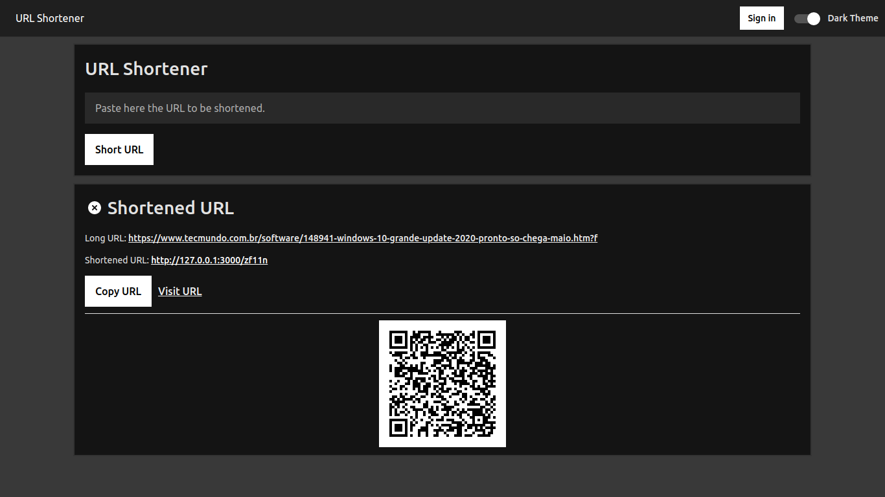

# URL Shortener

## Author

| [ @lucasgdb](https://github.com/lucasgdb) |
| :------------------------------------------------------------------------------------------------------------------------------: |

## How to contribute

-   make sure you have mongodb server working on port 27017 or 28017.
-   command: `docker container run -d --name mongo -p 27017:27017 -p 28017:28017 -e MONGODB_USER="root" -e MONGODB_PASS="secret" -e MONGODB_DATABASE="url-shortener" tutum/mongodb:latest`
-   make sure you have nodejs and npm installed.
-   make sure you'll open an issue for any problem.
-   clone this repo (git clone https://github.com/lucasgdb/url-shortener.git)
-   enter into cloned directory.
-   type `yarn` or `npm install`
-   make the changes.
-   send a PR.

## Image

